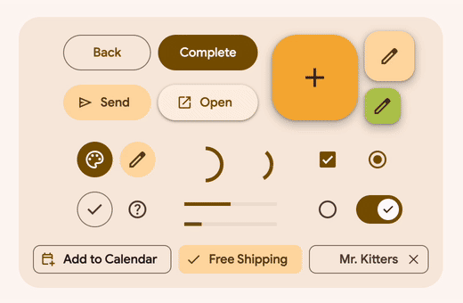

# Material Design 3

Sistema de diseño de código abierto de Google: [MaterialDesing3](https://m3.material.io/)

## [Qué es material?](https://m3.material.io/get-started)

Material Design introdujo un sistema visual coherente basado en el uso de __sombras, animaciones, transiciones__ y una estructura jerárquica que simulaba materiales físicos, como el __papel y la tinta__.

La idea es dar un aspecto más tangible y accesible a las interfaces digitales, como si los elementos de la interfaz fueran objetos reales en un entorno físico.


>Material Design es un sistema de diseño desarrollado y respaldado por diseñadores y desarrolladores de Google. Material.io incluye una guía detallada de UX e implementaciones de componentes de UI para __Android, Flutter y la Web__ basados en:
* __Fundamentos de UX__
* __Código fuente abierto__
* __Tutoriales, casos prácticos y noticias__

## Breve historia de Material Design
El concepto original fue presentado por Google en 2014 como parte de la actualización de la interfaz de usuario para Android Lollipop.


Desarrollar un único sistema subyacente que permita una experiencia unificada a través de plataformas y tamaños de dispositivos. Los preceptos móviles son fundamentales, pero el tacto, la voz, el ratón y el teclado son todos métodos de entrada de primera clase.


- Las superficies y los bordes del material proporcionan señales visuales que están cimentadas en la realidad
- Los elementos fundacionales del diseño basado en la impresión y tipografía, rejillas, espacio, escala, color y uso de imágenes. Estos elementos hacen mucho más que complacer al ojo
- 

## [Uso de material](https://m3.material.io/get-started)
>En Material.io, el sistema de diseño se organiza en tres partes principales: bases , estilos y componentes .
* __[Fundamentos](https://m3.material.io/foundations)__
* __[Estilos](https://m3.material.io/styles)__
* __[Componentes](https://m3.material.io/components)__

## [Diseño](https://m3.material.io/styles)
>Guía de diseño, especificaciones y herramientas para agilizar el trabajo de pasar de Figma a los productos terminados.

- __Estilos y personalización__ 
- __Diseños adaptativos__
- __Figma M3 Design Kit__

## [Desarrollo](https://m3.material.io/develop)
>Los últimos componentes de material, tutoriales, estudios de casos y documentación.
- __Android__
- __Flutter__
- __[Web](https://m3.material.io/develop/web)__
# Material Web


## [Conozca Material Web 1.0](https://github.com/material-components/material-web)

# Material Web



[](https://www.npmjs.com/package/@material/web)
[](https://lit.dev/discord/)
[](https://github.com/material-components/material-web/actions/workflows/test.yml)
[](https://npm-stat.com/charts.html?package=%40material%2Fweb)
[](https://www.jsdelivr.com/package/npm/@material/web?tab=stats)

`@material/web` is a library of
[web components](https://developer.mozilla.org/en-US/docs/Web/Web_Components)<!-- {.external} -->
that helps build beautiful and accessible web applications. It uses
[Material 3](https://m3.material.io/)<!-- {.external} -->, the latest version of Google's
open-source design system.

**Note:
[MWC is in maintenance mode pending new maintainers](https://github.com/material-components/material-web/discussions/5642).**

## Resources

-   [Introduction](./docs/intro.md)
-   [Roadmap](./docs/roadmap.md)
-   [Component docs](./docs/components/)
-   [Bundle size](./docs/size.md)
-   [Browser support and FAQ](./docs/support.md)

## Quick start

> Tip: Using Angular? We recommend using
> [Angular Material](https://material.angular.io/)<!-- {.external} --> components
> instead.

This code snippet is a buildless example that loads `@material/web` from a CDN.
Check out the [quick start](./docs/quick-start.md) guide to install and build
for production.

<!-- LINT.IfChange -->

```html
<head>
  <link href="https://fonts.googleapis.com/css2?family=Roboto:wght@400;500;700&display=swap" rel="stylesheet">
  <script type="importmap">
    {
      "imports": {
        "@material/web/": "https://esm.run/@material/web/"
      }
    }
  </script>
  <script type="module">
    import '@material/web/all.js';
    import {styles as typescaleStyles} from '@material/web/typography/md-typescale-styles.js';

    document.adoptedStyleSheets.push(typescaleStyles.styleSheet);
  </script>
</head>
<body>
  <h1 class="md-typescale-display-medium">Hello Material!</h1>
  <form>
    <p class="md-typescale-body-medium">Check out these controls in a form!</p>
    <md-checkbox></md-checkbox>
    <div>
      <md-radio name="group"></md-radio>
      <md-radio name="group"></md-radio>
      <md-radio name="group"></md-radio>
    </div>

    <md-outlined-text-field label="Favorite color" value="Purple"></md-outlined-text-field>

    <md-outlined-button type="reset">Reset</md-outlined-button>
  </form>
  <style>
    form {
      display: flex;
      flex-direction: column;
      align-items: flex-start;
      gap: 16px;
    }
  </style>
</body>
```

<!-- LINT.ThenChange(./g3doc/docs/quick-start.md) -->